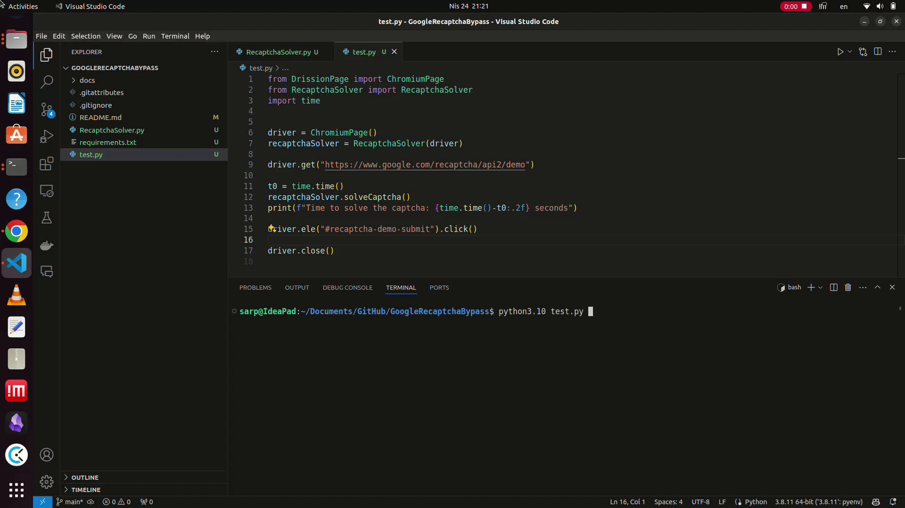

# Google Recaptcha Solver

**We love bots ❤️, but Google doesn't.** So, here is the solution to bypass Google reCAPTCHA.

Solve Google reCAPTCHA less than 5 seconds! 🚀

This is a Python script to solve Google reCAPTCHA using the DrissionPage library. *~~Selenium implementation will be added soon.~~*

## Recent Updates

Good news! Selenium implementation is added. Thanks to [@obaskly](https://github.com/obaskly) for the contribution. Check out the [selenium branch](https://github.com/sarperavci/GoogleRecaptchaBypass/tree/selenium) for more details.

## Sponsors

### CapMonster.Cloud

✅ CapMonster.Cloud — Fast, Reliable CAPTCHA Solving for Automation & Scraping

[](https://capmonster.cloud/en/?utm_source=github&utm_campaign=sarperavci_GoogleRecaptchaBypass)

If you are tired of wasting time solving endless CAPTCHAs during scraping, automation, or testing — we've got a solution for you.  
Meet CapMonster.Cloud — the AI-powered CAPTCHA solving service trusted by thousands of users worldwide. 🚀

--

🔥 **Why users love CapMonster.Cloud**
  
💡 Very high success rates (up to 99%)  
⚡ Super fast solving times  
💲 Affordable transparent pricing (pay per 1,000 CAPTCHAs)  
🔌 Easy integration via API + browser extensions  
⭐ Excellent reviews on TrustPilot, SourceForge, SaaSHub, AlternativeTo

--

🔗 **Useful Links**

💲 [Pricing & Supported CAPTCHA Types (25+ types supported)](https://capmonster.cloud/en?utm_source=github&utm_campaign=sarperavci_GoogleRecaptchaBypass#new-plans)  
📘 [API Documentation](https://docs.capmonster.cloud/?utm_source=github&utm_campaign=sarperavci_GoogleRecaptchaBypass)  
💡 Main Website → [capmonster.cloud](https://capmonster.cloud/en/?utm_source=github&utm_campaign=sarperavci_GoogleRecaptchaBypass)  
⭐ Reviews → [TrustPilot](https://www.trustpilot.com/review/capmonster.cloud)

---

### RapidProxy

[](https://www.rapidproxy.io/?ref=sarperavci)

[**RapidProxy**](https://www.rapidproxy.io/?ref=sarperavci) – Power Your Data with Premium Proxies

🎁 Try proxies [**for free**](https://www.rapidproxy.io/?ref=sarperavci) + Use code **RAPID10** for 10% OFF

**Why Choose RapidProxy?**

* 90M+ IPs in 200+ countries & regions  
* No expiration on traffic — use anytime, no pressure  
* Unlimited concurrency for maximum performance  
* Starting from just $0.65/GB — built for scale  
* City-level targeting for precise geo access  
* Flexible session control tailored to your needs  
* Enterprise-grade speed & reliability  
* Built for large-scale automation  

**💡 Built for Growth**

Whether you're scaling scraping operations, running automation, or accessing global content, RapidProxy delivers the speed, stability, and flexibility you need to grow without limits.

👉 Start your free trial today: [https://www.rapidproxy.io/?ref=sarperavci](https://www.rapidproxy.io/?ref=sarperavci)

---
<!-- /AD -->

## Installation
Three dependencies are required to run this script. You can install them using the following command:
```bash
pip install -r requirements.txt
```

Also, you need to install ffmpeg. You can download it from [here](https://ffmpeg.org/download.html).

```bash
sudo apt-get install ffmpeg
```

## Usage

To implement this script in your project, you can follow a similar approach as shown below:

```python
from DrissionPage import ChromiumPage 
from RecaptchaSolver import RecaptchaSolver
driver = ChromiumPage()
recaptchaSolver = RecaptchaSolver(driver)
driver.get("https://www.google.com/recaptcha/api2/demo")
recaptchaSolver.solveCaptcha()
```

I have created `test.py` to demonstrate the usage of this script. You can run the `test.py` file to see the script in action.


## Demo



 
## How does it work?

We automate the browser to solve the reCAPTCHA. Instead of image captcha, we are solving the audio captcha. The audio captcha is easier to solve programmatically.

**One warning:** Google may block your IP if you solve too many captchas in a short period of time. So, use this script wisely or change your IP frequently.

## Star History

<a href="https://star-history.com/#sarperavci/GoogleRecaptchaBypass&Date">
 <picture>
   <source media="(prefers-color-scheme: dark)" srcset="https://api.star-history.com/svg?repos=sarperavci/GoogleRecaptchaBypass&type=Date&theme=dark" />
   <source media="(prefers-color-scheme: light)" srcset="https://api.star-history.com/svg?repos=sarperavci/GoogleRecaptchaBypass&type=Date" />
   
 </picture>
</a>
